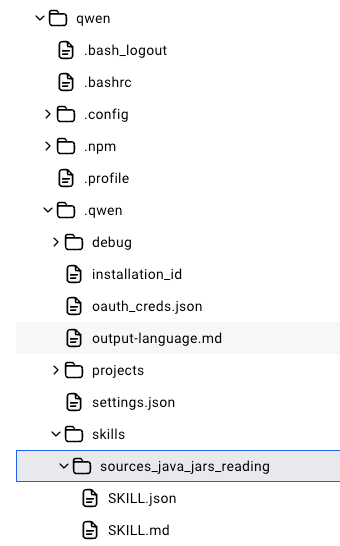

# qwen-code-docker

## Перед стартом
1) Создать папки `qwen-data` и `shared` в корне проекта
2) Скопировать папку [0-skills](0-skills) в `shared`
3) Положить проект (если нужно) в папку `shared`

## Запуск
Выполнить команду
```shell
docker build -t epk/qwen-code-docker:0.1.0 . && docker compose up -d
```

Будет развернуто один или несколько контейнеров с qwen code (задается в `services.qwen-code.deploy.replicas`)
При этом скилл должен после старте будет скопирован в рабочую папку .qwen каждого контейнера \


## Начало работы
1) перейти в нужную папку внутри контейнера `cd shared/<папка с проектом>`
2) для старта в консоли докер-контейнера докера набираем команду `qwen`
3) после старта авторизуемся по OAuth (с гуглопочтой, например) - при этом токен будет лежать в замонтированной 
папке `qwen-data/oauth_creds.json`. После рестарта контейнера токен сохранится, и, если он не протух, можно продолжить 
работу
4) настраиваем квен `/settings` - язык и локаль ru-RU, перезапускаем сессию
5) далее для квена нужно подключить скилл `/skills sources_java_jars_reading`
6) далее производим `/init` проекта - квен создаст файл QWEN.md
7) можно работать `;-)`

## Описание скилла [sources_java_jars_reading](0-skills/sources_java_jars_reading)
Можно почитать само описание [SKILL.md](0-skills/sources_java_jars_reading/SKILL.md), для работы скилла в проекте в папку
`.sources` нужно подложить недостающие библиотеки, к которым квен будет обращаться по определенному правилу
